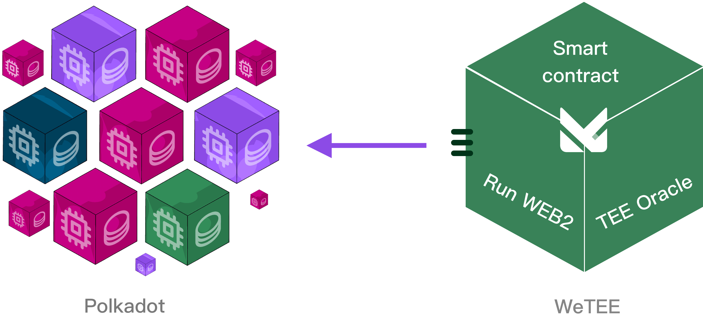

# OVERVIEW

<figure><figcaption></figcaption></figure>

With the development of Web3, more and more applications will be directly deployed on chain, or partially store business data on chain. These applications mainly use a front-end / back-end separation architecture, that is, the applications consist of a user interface and a backend built by smart contracts. In theory, any type of application can run on a network with smart contract functionality, but at the same time, these applications also need to compromise for the relatively scarce computing resources on the decentralized network and the high latency in processing business data.
