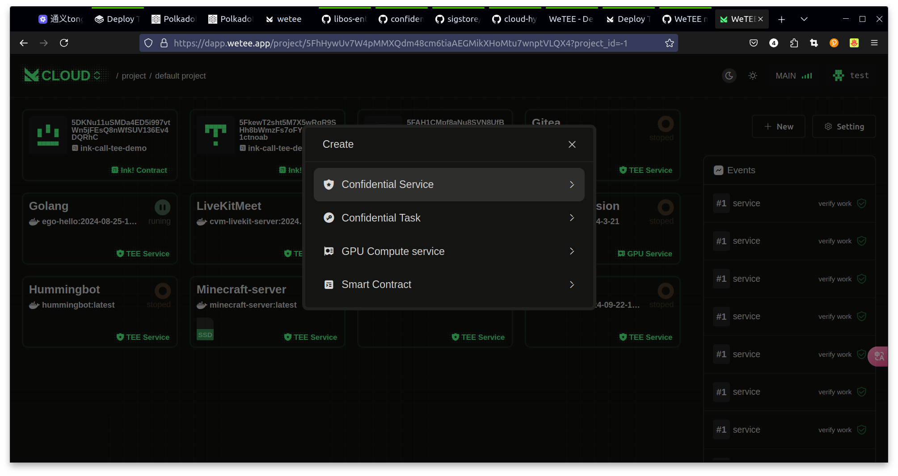

# Deploy TEE program on WeTEE

## Prepare machines that support SGX

CPU Support

* Intel 8th generation (Cannon Lake) Core i3, i5, i7, and i9 processors
* Intel 9th generation (Cascade Lake) Core i3, i5, i7, and i9 processors
* Intel 10th generation (Comet Lake) Core i3, i5, i7, and i9 processors
* 2nd Generation Xeon Scalable processors (Cascade Lake) and later generations generally provide - SGX capabilities.

## Install Ubuntu 20.04/22.04 and the ego programming environment

1\. Install base pkg

```
sudo apt install curl build-essential libssl-dev
```

2\. Install sgx repp key

```
sudo curl -s https://download.01.org/intel-sgx/sgx_repo/ubuntu/intel-sgx-deb.key | sudo tee /etc/apt/keyrings/intel-sgx-keyring.asc > /dev/null
sudo echo "deb [signed-by=/etc/apt/keyrings/intel-sgx-keyring.asc arch=amd64] https://download.01.org/intel-sgx/sgx_repo/ubuntu focal main" | sudo tee /etc/apt/sources.list.d/intel-sgx.list
```

3\. Install sgx driver

```
sudo apt-get update && sudo1 apt-get install -y libsgx-dcap-ql libsgx-dcap-default-qpl  libsgx-enclave-common 
```


## Initialize a Golang project

```
go mod init xxx/ego-demo
```

## Add SGX SDK to the project

```
go get github.com/wetee-dao/libos-entry@v0.1.0
```

## Write demo code named hello

```go
package main

import (
	"net/http"

	"github.com/wetee-dao/libos-entry/entry/ego"
)

func main() {
	// ADD TEE sdk
	err := ego.InitEgo()
	if err != nil {
		panic(err)
	}

	http.HandleFunc("/", resourceHandler)
	err = http.ListenAndServe(":8999", nil)
	if err != nil {
		panic(err)
	}
}

func resourceHandler(w http.ResponseWriter, req *http.Request) {
	w.WriteHeader(http.StatusOK)
	w.Write([]byte("hello world"))
}

```

## Compile into a binary program

```bash
ego-go build hello.go
```

## Sign the binary program

```bash
ego sign hello
```

## Run the program using ego

```bash
ego run hello
```


## Edit Dockerfile and build docker

```docker
FROM registry.cn-hangzhou.aliyuncs.com/wetee_dao/ego-ubuntu-deploy:22.04
WORKDIR /

# Add the hello 
ADD hello  /hello
# Add the hello end

EXPOSE 8999 65535

ENTRYPOINT ["/bin/sh", "-c" ,"ego run hello"]
```

```bash
docker build xxxx/ego-hello:dev .
docker push xxxx/ego-hello:dev
```


## Deploy to WeTEE

Open [https://dapp.wetee.app](https://dapp.wetee.app)\


<figure><figcaption></figcaption></figure>

Add SGX Confidential Service

[**TEE type select SGX**](#user-content-fn-1)[^1]

<figure><figcaption></figcaption></figure>

Click Deploy&#x20;

[^1]: 
