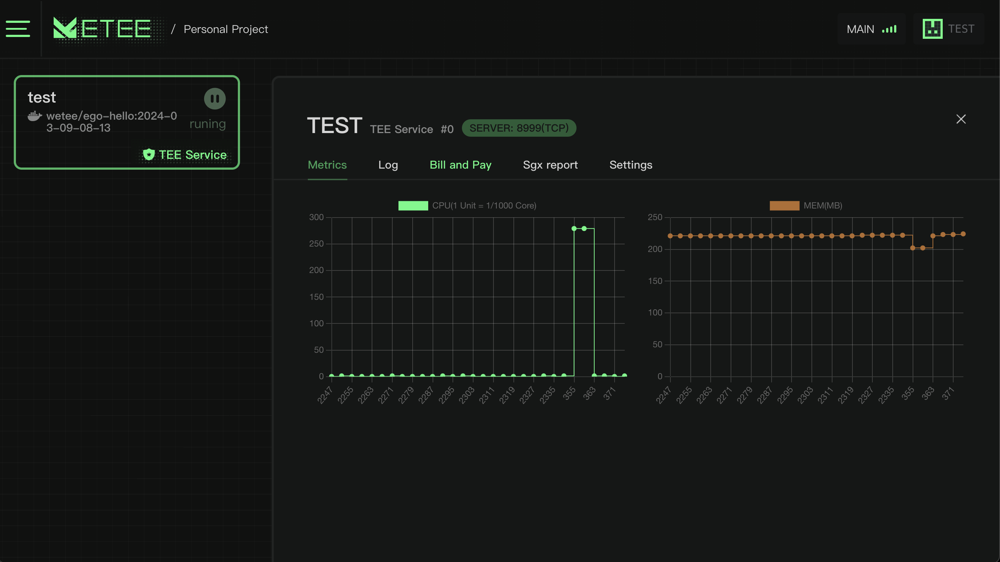

# Confidential Service

Within a DAPP, we can deploy confidential containers, enabling users to deploy and run a pre-packaged confidential container without requiring expertise in confidential computing within just 10 seconds.

<figure><figcaption></figcaption></figure>

We provide a centralized cloud-like experience where users can view the resource utilization of programs, check logs, and validate if programs are being executed confidentially.

<figure><figcaption></figcaption></figure>
