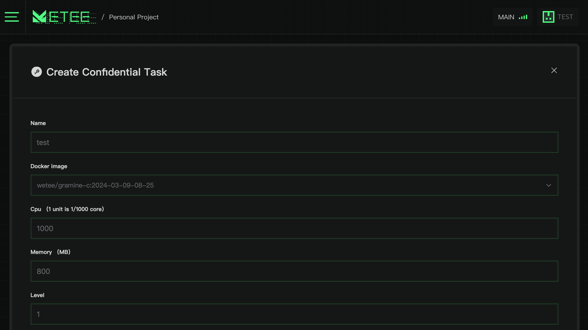
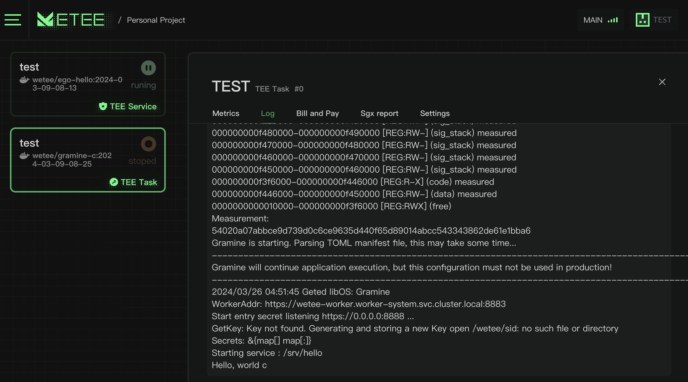

# Confidential Task

Tasks can also be created, and they can be executed either once or multiple times.

<figure><figcaption></figcaption></figure>

A task can be executed once or multiple times, and the result of each execution will be hashed and stored in a decentralized network.

<figure><figcaption></figcaption></figure>
