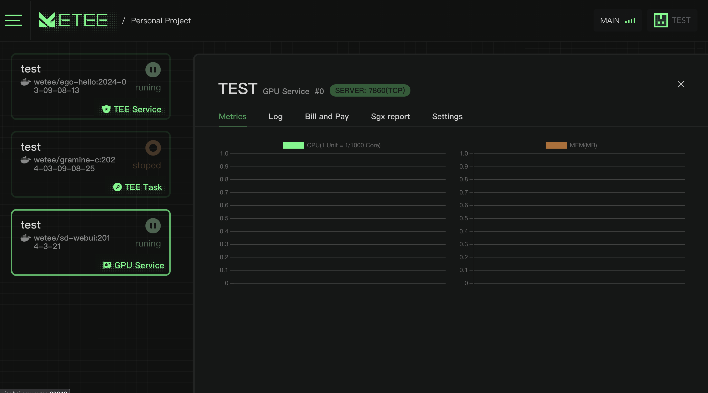

# GPU Compute service

We have also adapted AI applications so that AI program containers can be deployed in decentralized environments with minimal modifications and still deliver performance comparable to running on the cloud.

Due to our utilization of containerized packaging, developers can seamlessly transition from their current cloud setups.

<figure><figcaption></figcaption></figure>
