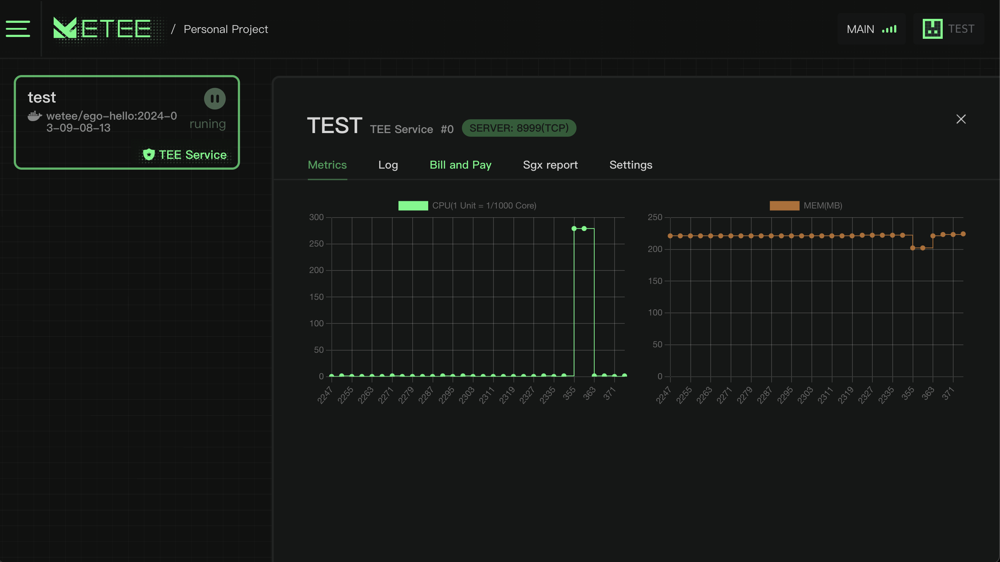

# 机密服务 (Confidential Service)

在 DAPP 中，我们可以部署机密容器，使用户能够在短短 10 秒内部署并运行预打包的机密容器，而无需具备机密计算方面的专业知识。

<figure><figcaption></figcaption></figure>

我们提供类似中心化云的体验，用户可以查看程序的资源利用率、检查日志，并验证程序是否正在以机密方式执行。

<figure><figcaption></figcaption></figure>
